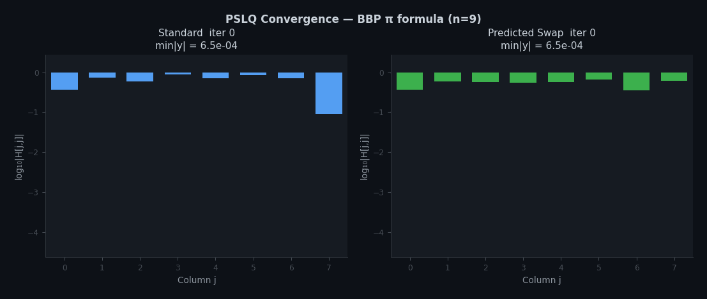

# PSLQ Integer Relation Detection — C/FLINT Implementation

A reimplementation of Bailey's multipair PSLQ algorithm in C using the [FLINT](https://flintlib.org/) arbitrary-precision library. On an Apple M1 Max (64 GB), the combined optimizations achieve 4–14× speedups over the single-threaded FLINT baseline (standard strategy, Bailey's default ndpm) across Poisson summation problems.

All benchmarks in this document were run on the same machine: Apple M1 Max, 64 GB RAM, macOS, FLINT 3.5, compiled with `cc -O2 -march=native`.



*H diagonal evolution on BBP π (n=9). Standard (blue, 18 iterations) vs predicted_swap (green, 4 iterations). Interactive versions: [standard](visualizations/pslq_explorer_standard.html) | [predicted_swap](visualizations/pslq_explorer_predicted_swap.html)*

## How PSLQ Works

Given a vector of real numbers **x** = (x₁, x₂, ..., xₙ), PSLQ finds integer coefficients **m** = (m₁, m₂, ..., mₙ) such that m₁x₁ + m₂x₂ + ... + mₙxₙ = 0, or certifies that no such relation exists with norm below a computable bound. This is used to discover BBP-type formulas, minimal polynomials, and Poisson summation identities.

The multipair variant operates at three precision levels in a cycle:

1. **DP (double precision, 53 bits)** — Fast inner loop. Selects disjoint pairs of rows using γ-weighted diagonal magnitudes (γ = √(4/3)), swaps them, applies Givens rotations, and performs Hermite reduction. Runs up to `ipm` iterations per batch.

2. **MPM (medium precision, ndpm digits)** — Applies the accumulated DP row operations to the medium-precision H, y, wa, wb matrices. Detects when DP precision is exhausted (izd=1: min|dy| < 10⁻¹⁴ or max|da/db| > 10¹³) or fully overflows (izd=2: max|da/db| > 2⁵²), triggering a flush upward.

3. **Full MP (full precision, digits)** — Periodic high-precision sync. Updates the full-precision H, B, y matrices and checks for relation detection. This is the most expensive step (O(n³) arithmetic at full_prec bits).

A relation is detected when min|y_i| drops below ε × max|B_row(i)|, at which point the corresponding row of B gives the integer coefficients.

## What This Implementation Changes

### 1. FLINT's CRT Architecture — Better Baseline

The single largest source of speedup comes from switching the arithmetic library from MPFUN2020 to FLINT.

FLINT's `fmpz_mat_mul` uses **CRT (Chinese Remainder Theorem) multi-modular arithmetic**: it reduces a big-integer matrix multiply into independent word-level (64-bit) matrix multiplies modulo small primes, then reconstructs the result via CRT.

On top of FLINT, we wrote a column-parallel layer (ColPar) that handles threading and precision for both `mxmdm` (MPM updates) and `mxm` (fullMP updates). The problem ColPar solves: FLINT's `fmpz_mat_mul` operates on integer matrices, but our data lives in `arb_t` (floating-point with mantissa × 2^exp). Converting the entire matrix to `fmpz` requires choosing a single minimum exponent and shifting all mantissas to align — but matrix columns can span thousands of bits in magnitude (especially H during fullMP), so a global exponent wastes precision on smaller columns. ColPar splits the B matrix by columns across pthreads, converts each column slice to `fmpz` with its own per-column minimum exponent, calls `fmpz_mat_mul` on the slice, and reconstructs the `arb_t` result. FLINT handles the CRT multiply; ColPar handles the column distribution and exponent bookkeeping.


### 2. ndpm Tuning — CRT Makes Low Precision Cheap

The medium precision level (ndpm) controls the bit-width of the MPM matrices. Each `mxmdm` call does a CRT-based matrix multiply at ndpm precision — FLINT decomposes this into `ceil(ndpm_bits / 59)` independent word-level n×n multiplies. Lowering ndpm directly reduces the number of passes.

Bailey's Fortran code uses conservative ndpm defaults (e.g., ndpm=3000 for s=24, which is `ceil(3000 × 3.32 / 59) ≈ 169` CRT passes per mxmdm). At ndpm=1000, this drops to `ceil(1000 × 3.32 / 59) ≈ 57` passes — 3× fewer.

This is a property of how FLINT structures the computation. Because CRT decomposes the problem into independent word-level multiplies, the cost scales proportionally with the number of passes — halving ndpm roughly halves the mxmdm cost. MPFUN2020 uses Karatsuba/FFT for its big-integer multiplies, where the cost scales sublinearly with precision. Halving ndpm in MPFUN saves less because the FFT-based multiply doesn't get proportionally cheaper.

The tradeoff: lower ndpm exhausts MPM precision faster, triggering more fullMP updates. fullMP is expensive — it involves O(n³) arithmetic at full precision (thousands of digits), so the cost of each additional fullMP is not negligible. But at small n (e.g., n=65) each fullMP is ~4s, while the mxmdm savings from halving ndpm can be hundreds of seconds, so the tradeoff is favorable. At larger n (e.g., n=197) each fullMP costs ~34s, which shifts the optimal ndpm higher. The key point is that CRT makes the mxmdm side of this tradeoff much steeper than it would be with FFT-based arithmetic, so the optimal ndpm is lower with FLINT than with MPFUN.

**psi_s24 ndpm sweep (predicted_swap, 1 thread):**

| ndpm | CRT passes per mxmdm | Wall time | fullMP count |
|------|---------------------|-----------|--------------|
| 3000 (Bailey default) | ~169 | 476s | 7 |
| 1500 | ~85 | 220s | 13 |
| 1000 | ~57 | 175s | 18 |
| 700 | ~40 | 178s | 26 |

The optimal ndpm balances cheaper mxmdm calls against more frequent fullMP updates. For n=65 problems, ndpm=700–1000 is optimal — below 700, the fullMP count rises fast enough to offset the mxmdm savings. For larger n (S29, n=197) where each fullMP costs ~34s, the optimal ndpm stays closer to Bailey's default.

This requires no code changes, just setting a lower ndpm value. Finding the optimal value for a new problem does require an empirical sweep.

### 3. Intermediate Precision Layer (IP)

The standard 3-level algorithm flushes DP operations directly to MPM, which is expensive when ndpm is large. The IP layer adds a buffer between DP and MPM:

```
DP (53 bits) → IP (~200-500 bits) → MPM (~10K bits) → Full MP
```

When DP precision exhausts (izd=1), instead of flushing to MPM at full mpm_prec cost, the DP operations are applied to the IP-precision copies of H and y. The IP layer accumulates these updates as exact integer matrices (qa, qb) and only flushes to MPM when the IP precision itself exhausts.

The DP row operations (da, db matrices) are integer-valued at double precision — they consist of rounded Hermite reduction coefficients. The IP layer accumulates these as exact `fmpz_mat` products (ia = da × ia_prev), avoiding any floating-point truncation in the accumulation itself. The IP-precision copies of H and y absorb these operations at ~200 bits instead of ~10,000 bits, so each IP-level matrix multiply uses far fewer CRT passes than an MPM-level one.

**When IP works:** The IP layer requires two conditions:
- **H_col_spread > 370 bits** — H_col_spread is the range of column magnitudes in the initial H matrix, measured as `max_col_exp - min_col_exp` in bits across all columns. It is determined by the input constant: roughly `|log₁₀(α)| × (n-1) × 3.32` bits. When H entries span a wide range, IP has room to absorb multiple DP flushes before its own precision exhausts.
- **Baseline izd=2 = 0** — izd=2 events mean DP fully overflows (max|da/db| > 2⁵²), requiring a full savedp restore. When these occur, the IP layer cannot help because the DP state needs reconstruction from the last checkpoint, not a precision flush.

**Optimal IP value:** H_col_spread / 6 (validated across 8 problems within ±10%). This could be computed automatically at runtime from the initial H matrix.

**When IP doesn't work:** Problems with narrow H_spread (e.g., Poisson φ₂ s=30, H_spread=241 bits) or nonzero izd=2 counts (e.g., Poisson φ₂ S29) cannot use IP. The Poisson ψ₂ family (s=24, s=22, s=17, etc.) generally has wide H_spread and works well with IP.

**Stability warning:** The IP layer is still experimental. It has been tested on a limited set of problems and is known to occasionally cause unexpected failures on problems outside the tested families. If a run fails with IP enabled, retry with `IP_BITS=0` to disable it. Further work is needed to understand its failure modes and make it robust across arbitrary inputs.

### 4. Predicted Swap Strategy

Bailey's original PSLQ selects swap pairs based on γ^i × |H[i,i]| ranking — it picks the disjoint pairs with the largest weighted diagonals, swaps them, applies Givens rotations, and moves on. No further reordering is done within the DP iteration.

The **predicted_swap** strategy adds a second pass: after the standard pair selection and Givens rotations, it runs a bidirectional insertion sort over the H diagonal. Each candidate swap is evaluated by simulating the Givens rotation that would follow.

For a candidate swap at position r, the Givens rotation that restores lower-triangular form produces new diagonal entries:

```
d  = √(H[r+1,r]² + H[r+1,r+1]²)

H'[r,r]   = d
H'[r+1,r+1] = (-H[r,r]·H[r+1,r+1] + H[r,r+1]·H[r+1,r]) / d
```

The swap is accepted only if the **diagsum criterion** holds:

```
|H'[r,r]| + |H'[r+1,r+1]| < |H[r,r]| + |H[r+1,r+1]|
```

Before committing, a **neighbor check** prevents oscillation. For the forward pass (checking position r-1):

```
x  = H[r+1,r-1]
d₂ = √(x² + d²)

reject if:  d₂ + d·|H[r-1,r-1]|/d₂ - |H[r-1,r-1]| - d  ≥  0
```

This tests whether swapping at r would worsen the adjacent position's potential for improvement. The backward pass applies an analogous check at position r+1.

The forward pass sorts left to right, the backward pass right to left.

**Where it matters most.** Predicted_swap's impact scales with problem difficulty. On phi_s29 (n=197), the profile data shows clearly how the iteration reduction cascades:

| Metric | Standard | Predicted_swap | Reduction |
|--------|----------|---------------|-----------|
| DP iterations | 166,000 | 34,000 | 4.8× |
| mxmdm calls | 24,872 | 8,588 | 2.9× |
| updtmpm calls | 6,218 | 2,147 | 2.9× |
| fullMP triggers | 77 | 63 | 1.2× |
| Wall time (1 thread) | 7,387s | 3,596s | 2.1× |

The 4.8× DP iteration reduction directly causes 2.9× fewer MPM-level matrix multiplies (mxmdm), because fewer DP iterations means fewer batches that need to be flushed to MPM. The fullMP reduction is smaller (1.2×) but still contributes — each fullMP at n=197 costs ~34s at 1 thread. The net wall-time speedup of 2.1× comes primarily from the mxmdm savings.

This doesn't always translate to meaningful speedup. On psi_s24 (n=65), predicted_swap still reduces iterations by 3.4× — but the wall-time improvement is only 1.1× (529s → 476s). At n=65, each mxmdm call is cheap enough that doing fewer of them barely matters; the total mxmdm time dominates regardless. The iteration reduction is real but the operations it saves are inexpensive. Predicted_swap's value grows with n, where the per-call cost of mxmdm rises and each avoided call saves more time.

**Convergence.** We have not proved that predicted_swap preserves the theoretical convergence guarantees of PSLQ. Bailey's convergence proof relies on the specific γ-weighted pair selection rule; our additional sorting passes modify the row ordering beyond what the proof covers. In practice, predicted_swap has found correct relations on every problem tested — including problems up to n=197 at 20,000-digit precision — and has never failed to converge where standard PSLQ succeeds. But this is empirical stability, not a proof.

**Relationship to other strategies.** Predicted_swap was selected from an exhaustive search over ~100 sorting variants, including: pure bidirectional sort without simulation, exponential decay weighting, product and max-reduction criteria, multi-pass variants, rolling-window lookahead, and numerous heuristic scoring functions. Many produce similar iteration counts to predicted_swap. This one was the fastest across problem families tested and has been stable on every problem — several of the alternatives occasionally caused divergence on specific problems where predicted_swap did not.

### 5. Threading

The tradeoffs from lower ndpm (more fullMPs) and predicted_swap both become less costly when those operations are threaded, which FLINT supports via CRT parallelism and ColPar.

**psi_s24 thread scaling (predicted_swap + ndpm=1000 + IP=300):**

| Threads | Time | Speedup |
|---------|------|---------|
| 1 | 116s | 1.0× |
| 4 (M1 Max) | 37.6s | 3.1× |

Scaling is near-linear to 4 threads on Apple Silicon. Previous AWS benchmarks showed useful scaling to 8-16 threads on AMD EPYC (64 vCPU), with diminishing returns past 16 for n=65 matrices.

## Combined Results

All optimizations stack multiplicatively:

**Poisson ψ₂ s=24 (n=65) vs MPFUN2020 baseline (532s, ndpm=3000, 1 thread):**

| Optimization | Wall | Cumulative speedup |
|-------------|------|--------------------|
| FLINT standard ndpm=3000, 1 thread | 529s | baseline |
| + predicted_swap | 476s | 1.1× |
| + ndpm=1000 | 175s | 3.0× |
| + IP=300 | 116s | 4.6× |
| + 4 threads | 37.6s | **14×** |

**Poisson φ₂ s=29 (n=197), 4 threads — no IP (izd=2 prevents it):**

| Config | Wall | vs standard baseline |
|--------|------|--------------------|
| standard ndpm=1000 | 2511s (42 min) | baseline |
| predicted_swap ndpm=1000 | 1183s (20 min) | 2.1× |
| predicted_swap ndpm=600 | 1088s (18 min) | 2.3× |
| predicted_swap ndpm=800 | 1088s (18 min) | **2.3×** |

**phi_s29 cumulative speedup (n=197, no IP available):**

| Config | Time | vs baseline |
|--------|------|------------|
| standard ndpm=1000, 1 thread | 7,387s (2.1 hr) | baseline |
| + predicted_swap | 3,596s (60 min) | 2.1× |
| + 4 threads | 1,183s (20 min) | 6.2× |
| + ndpm=800 | 1,088s (18 min) | **6.8×** |

Note: phi_s29's default ndpm is already 1000 (Bailey's setting for this problem), so unlike psi_s24 there is no large ndpm reduction available. phi_s29 gains are smaller than psi_s24 because IP is unavailable (izd=2 > 0) and fullMP dominates at n=197 (~34s per fullMP at 1 thread). The predicted_swap iteration reduction (4.8× fewer) translates to 2.1× wall time through fewer mxmdm calls, and threading adds another 3.0×.

## When Each Optimization Helps

| Optimization | Best when | Doesn't help when |
|-------------|-----------|-------------------|
| Lower ndpm | Small n (mxmdm dominates) | Large n (fullMP dominates) |
| Predicted_swap | Always reduces iterations | Smallest wall-time gain on easy problems |
| IP | H_spread > 370 AND izd=2 = 0 | Narrow H_spread or izd=2 > 0 |
| Threading | Always helps to 8-16 threads | Diminishing returns past 16 for n < 200 |

## Problem Families Tested

| Problem | Type | n | Degree | Description |
|---------|------|---|--------|-------------|
| BBP40 | BBP | 40 | — | π via Σ 1/16^k terms |
| H2 | Algebraic | 111 | 110 | 3^(1/10) − 2^(1/11) minimal polynomial |
| psi_s24 | Poisson ψ₂ | 65 | 64 | ψ₂(2/24, 5/24) even-index lattice sum |
| phi_s29 | Poisson φ₂ | 197 | 196 | φ₂(1/29, 1/29) standard lattice sum |

The two Poisson families differ in their lattice sum structure:
- **ψ₂ (psi)**: Even-index lattice sum. α = exp(−8πs·ψ₂(p/s, q/s)). Tends to have wide H_spread → IP viable.
- **φ₂ (phi)**: Standard lattice sum. α = exp(8π·φ₂(1/s, 1/s)). Tends to have izd=2 > 0 → IP not viable.

---

## Running It

### Prerequisites

- FLINT 3.5+ (`brew install flint` on macOS) — includes GMP, MPFR
- Python 3.11+ with mpmath (`pip install mpmath`)

### Build

```bash
cd pslq/production
make
```

### Quick Test

```bash
cd test
python3 test.py --quick       # BBP40 smoke test (~1s)
python3 test.py               # Full H2 correctness matrix (~3 min)
```

### Performance Benchmarks

```bash
cd test
python3 performance.py psi_s24                  # ψ₂ s=24, 1 thread (~20 min)
python3 performance.py psi_s24 --threads 4      # ψ₂ s=24, 4 threads (~7 min)
python3 performance.py phi_s29 --threads 4      # φ₂ s=29, 4 threads (~hours)
python3 performance.py all --threads 4          # Both
```

Results are saved to `test/performance_results.json` and summarized in `test/results.md`.

### Environment Variables

| Variable | Default | Description |
|----------|---------|-------------|
| `STRATEGY` | `predicted_swap` | `standard` (no nudge) or `predicted_swap` (Givens-aware sort) |
| `THREADS` | `1` | FLINT thread count for CRT parallelism |
| `IP_BITS` | `0` (disabled) | Intermediate precision layer in bits. Set to H_spread/6 when viable |
| `IPM_OVERRIDE` | `10` | DP iterations per MPM checkpoint batch |

### Source Files

| File | Lines | Description |
|------|-------|-------------|
| `pslqm3.c` | 1777 | Main PSLQ engine — DP/MPM/fullMP cycle, strategy dispatch, entry point |
| `pslq_matmul.c` | 359 | CRT matrix multiply (mxmdm, mxm) + ColPar column-parallel threading |
| `pslq_4level.c` | 249 | Intermediate precision layer — IP init, update, flush to MPM |
| `pslq_arb.h` | 212 | Arb wrappers (round-to-nearest matching Fortran semantics) |
| `pslq_sort.c` | 171 | Quicksort for pair selection (exact Fortran translation) |

### Using from Python (ctypes)

```python
import ctypes

lib = ctypes.CDLL("pslqm3.dylib")
lib.pslqm3_c.restype = ctypes.c_int
lib.pslqm3_c.argtypes = [
    ctypes.c_int,                        # n
    ctypes.POINTER(ctypes.c_char_p),     # x_strs (decimal strings)
    ctypes.c_int,                        # digits (full precision)
    ctypes.c_int,                        # ndpm (medium precision digits)
    ctypes.c_int,                        # ndr (dynamic range requirement)
    ctypes.c_int,                        # nrb (norm bound limit)
    ctypes.c_int,                        # itm (iteration limit)
    ctypes.c_double,                     # unused
    ctypes.POINTER(ctypes.c_int64),      # result (output coefficients)
    ctypes.c_int,                        # strat (0=standard, 1=predicted_swap)
]

# Returns iq: 1 = relation found, 0 = not found
# Coefficients written to result array and /tmp/v29_rel.txt
```
